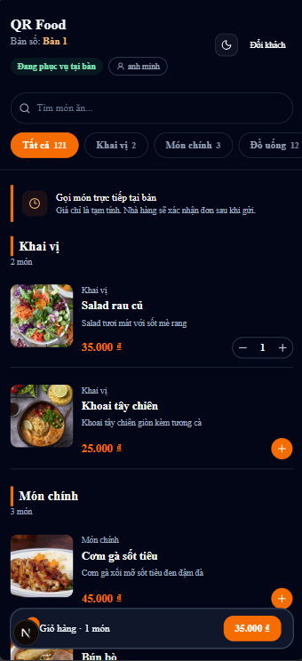
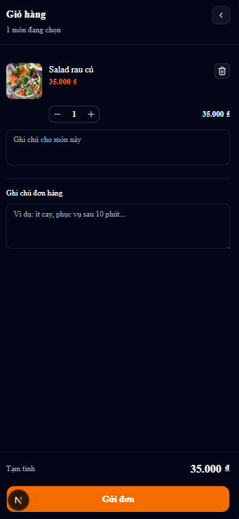
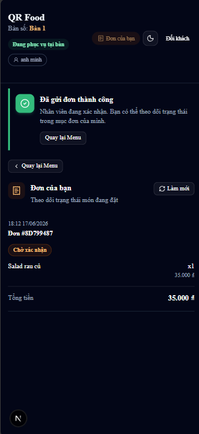
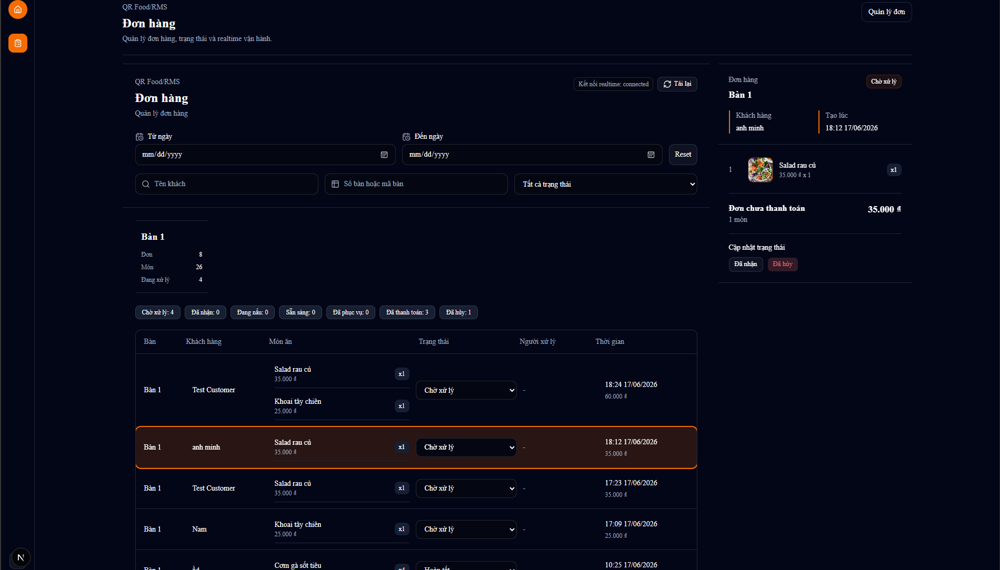
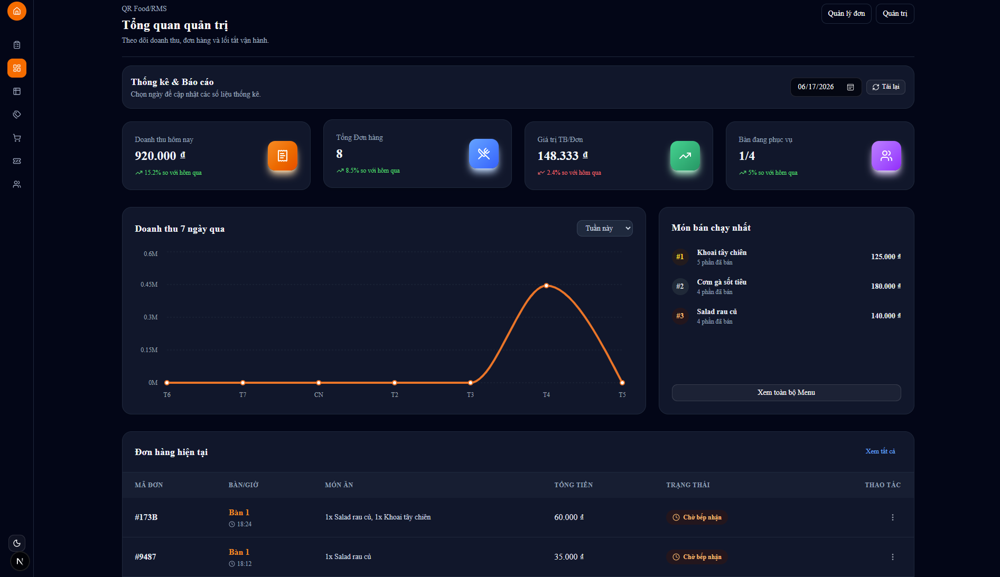
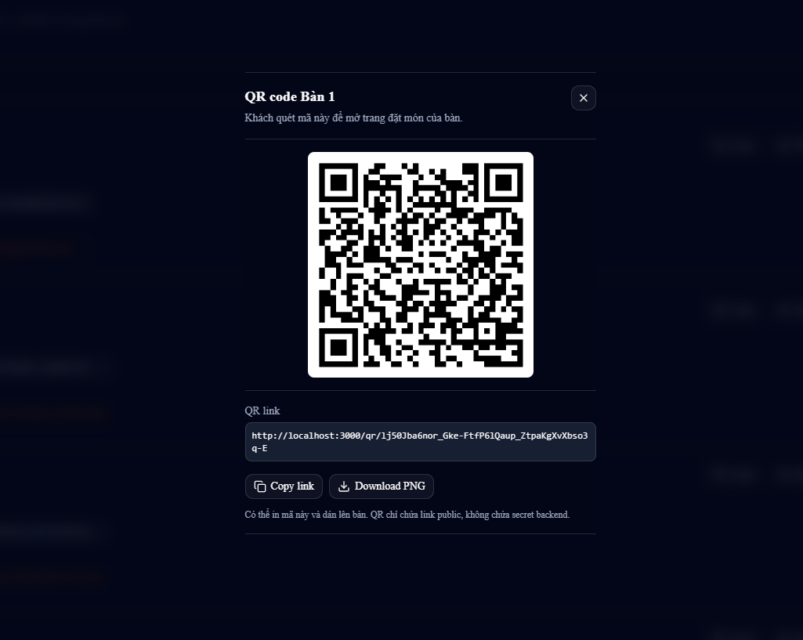
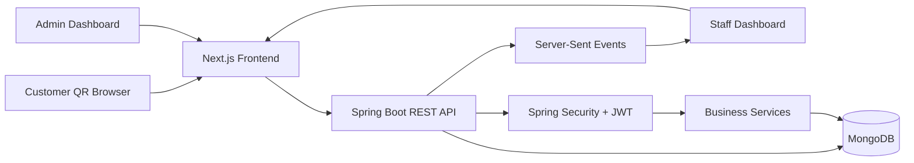

# QR Food Order System

A fullstack restaurant ordering and management system that allows customers to scan QR codes, place orders, and helps staff manage restaurant operations in realtime.


[](https://github.com/bachle1302/qr-food-order-system/actions/workflows/backend-ci.yml)
[](https://github.com/bachle1302/qr-food-order-system/actions/workflows/frontend-ci.yml)
[](https://github.com/bachle1302/qr-food-order-system/actions/workflows/docker-ci.yml)

## Demo

Live demo will be added soon.

| Customer Menu | Customer Cart | Customer Order Status |
|---|---|---|
|  |  |  |

| Staff Orders Dashboard | Admin Dashboard | QR Code Management |
|---|---|---|
|  |  |  |

## Project Overview

QR Food Order System is a fullstack restaurant management system designed for QR-based table ordering. Customers can scan a table QR code, check in, browse the menu, add dishes to cart, and place orders without creating an account.

The system reduces manual ordering steps in restaurants and improves communication between customers, staff, and administrators. Staff can manage order status in realtime, while admins manage operational data such as tables, QR tokens, categories, dishes, discounts, users, and revenue summaries.

## Key Features

### Customer

- Open a table-specific ordering page from a secure QR token.
- Check in as a guest without JWT authentication.
- Browse menu categories and dishes.
- Add dishes to cart with item notes and order notes.
- Place public QR orders without logging in.
- View only the orders that belong to the current `customerSessionId`.

### Staff

- View and filter managed orders.
- Filter orders by status, table, and date range.
- Update order status through the validated backend workflow.
- Receive realtime order events through Server-Sent Events.

### Admin

- Manage restaurant tables.
- Regenerate table QR tokens.
- View and copy QR links for customer ordering.
- Manage categories, dishes, discounts, and users.
- Toggle user active/inactive status.
- View revenue and daily order summaries.

### Security

- JWT-based authentication with access and refresh tokens.
- Role-based authorization using `ADMIN` and `STAFF`.
- Protected admin and staff APIs.
- Public QR ordering flow based on `qrToken` instead of raw `tableId`.
- Frontend middleware guards for `/admin/**` and `/staff/**`.

## Technical Highlights

### Secure QR Token Ordering

Instead of exposing internal table IDs in the public QR flow, the system uses secure table `qrToken` values. The backend resolves the table from the token and creates the order server-side, preventing clients from manipulating table IDs directly.

Admins can regenerate a table QR token if a QR code needs to be rotated. The client only sends selected dish IDs, quantities, notes, and the QR/customer session context; the backend validates dishes and calculates order pricing from database values.

### Frictionless Customer Ordering

Customers do not need an account to place an order. The public flow is designed for real restaurant usage: scan QR, check in, choose dishes, and submit an order. Staff and admin operations remain protected by JWT authentication and role-based authorization.

### Customer Session Isolation

Orders can be linked to a `customerSessionId`. The public session order endpoint validates both `customerSessionId` and `qrToken`, then returns only orders for the current customer session. This prevents a new customer at the same table from seeing orders created by a previous customer.

### Realtime Staff Workflow with SSE

The backend exposes a protected SSE endpoint at `/api/orders/events`. When a customer creates an order or staff changes an order status, the backend broadcasts realtime events such as `order-created` and `order-status-changed`.

### Order Status Workflow

Orders use a defined status lifecycle:

```text
NEW -> CONFIRMED -> PREPARING -> READY -> SERVED -> PAID -> COMPLETED
```

The backend also supports cancellation paths and validates allowed transitions through the `OrderStatus` enum. This prevents invalid status updates such as moving a completed or cancelled order back to an earlier state.

### Role-Based Protected APIs

Admin and staff operations are protected by Spring Security and JWT. Admin-only routes cover user management, menu management, table management, discounts, and revenue summaries. Staff can access operational order management APIs.

### Frontend Caching Strategy

Public menu data uses Next.js server-side fetch caching with revalidation for categories and dishes. QR table lookup uses `no-store` because token validity and table state should be checked fresh. Protected dashboards use client-side authenticated API calls.

### Fullstack Production-Oriented Structure

The project is structured as a fullstack monorepo with a Next.js frontend, Spring Boot backend, MongoDB database, Docker-based local environment, environment variables, route middleware, and GitHub Actions workflows.

## Tech Stack

| Layer | Technology |
|---|---|
| Frontend | Next.js 16, React 19, TypeScript, Tailwind CSS, shadcn/ui, next-themes |
| Backend | Java 17, Spring Boot 3.2, Spring Security, Spring Data MongoDB |
| Database | MongoDB |
| Auth | JWT access token, refresh token, BCrypt password hashing |
| Realtime | Server-Sent Events |
| QR | Frontend QR rendering with `qrcode` |
| Charts | Recharts |
| DevOps | Docker, Docker Compose, GitHub Actions |
| Testing | Spring Boot Test, Spring Security Test, ESLint, TypeScript compiler |

## System Architecture



The frontend communicates with the backend through REST APIs. Staff dashboards subscribe to SSE streams to receive realtime order updates. MongoDB stores users, tables, categories, dishes, customer sessions, orders, discounts, and payments.

## Main Data Models

| Model | Description |
|---|---|
| User | Admin and staff accounts with email, password hash, role, active status, and timestamps |
| Role | Role enum with `ADMIN` and `STAFF` |
| Table | Restaurant table with name, seats, availability, and secure `qrToken` |
| Customer | Guest customer identity created during check-in |
| CustomerSession | Active customer session linked to customer, table, and QR token |
| Category | Menu category |
| Dish | Menu item with description, image URL, price, category, and availability |
| Order | Customer order linked to table/session with totals, notes, created time, and status |
| OrderItem | Dish line item with dish ID, quantity, price at order time, and note |
| OrderStatus | Valid statuses and allowed backend transitions |
| Discount | Discount code configuration |
| Payment | Payment record linked to an order |

## API Highlights

### Public APIs

| Method | Endpoint | Description |
|---|---|---|
| POST | `/api/auth/login` | Staff/admin login |
| POST | `/api/auth/refresh` | Refresh JWT tokens |
| GET | `/api/tables/qr/{qrToken}` | Get table information by secure QR token |
| POST | `/api/customer-sessions/check-in` | Create or reuse a customer session for a QR table |
| GET | `/api/categories` | Get menu categories |
| GET | `/api/dishes` | Get dishes |
| POST | `/api/orders/public/qr` | Create an order from the QR ordering page |
| GET | `/api/orders/public/session/{customerSessionId}?qrToken=...` | Get orders for the current customer session only |

### Staff APIs

| Method | Endpoint | Description |
|---|---|---|
| GET | `/api/orders/manage` | Get and filter orders by status, table, and date range |
| GET | `/api/orders/manage/new` | Get new orders |
| GET | `/api/orders/manage/kitchen` | Get kitchen-relevant order statuses |
| PUT | `/api/orders/{id}/status` | Update order status with transition validation |
| GET | `/api/orders/events` | Subscribe to realtime order events |

### Admin APIs

| Method | Endpoint | Description |
|---|---|---|
| CRUD | `/api/tables` | Manage restaurant tables |
| POST | `/api/tables/{id}/regenerate-qr-token` | Regenerate a table QR token |
| CRUD | `/api/categories` | Manage menu categories |
| CRUD | `/api/dishes` | Manage dishes |
| CRUD | `/api/discounts` | Manage discount codes |
| CRUD | `/api/users` | Manage users and active status |
| GET | `/api/orders/summary/daily` | Get daily order summary |
| GET | `/api/orders/revenue/daily` | Get daily revenue |
| GET | `/api/orders/revenue/monthly` | Get monthly revenue |

## Project Structure

```text
qr-food-order-system/
├── backend/
│   ├── src/main/java/com/rms/
│   │   ├── config/
│   │   ├── controller/
│   │   ├── dto/
│   │   ├── model/
│   │   ├── repository/
│   │   ├── security/
│   │   └── service/
│   ├── src/main/resources/
│   ├── src/test/
│   ├── Dockerfile
│   └── pom.xml
├── frontend/
│   ├── src/app/
│   ├── src/components/
│   ├── src/features/
│   ├── src/shared/
│   ├── Dockerfile
│   └── package.json
├── docs/
│   └── screenshots/
├── docker-compose.yml
├── .env.example
├── README.md
└── LICENSE
```

## Getting Started

### Prerequisites

- Java 17+
- Maven 3.9+ or Maven Wrapper if added later
- Node.js 20+
- npm
- MongoDB or Docker
- Docker and Docker Compose for containerized setup

### Clone the repository

```bash
git clone https://github.com/YOUR_USERNAME/qr-food-order-system.git
cd qr-food-order-system
```

### Configure environment variables

```bash
cp .env.example .env
```

Update `.env` with local values. Do not commit `.env`.

### Run backend locally

```bash
cd backend
mvn spring-boot:run
```

Backend runs at:

```text
http://localhost:8017
```

### Run frontend locally

```bash
cd frontend
npm install
npm run dev
```

Frontend runs at:

```text
http://localhost:3000
```

## Environment Variables

### Root `.env`

The repository includes `.env.example` with safe placeholders. Use it as a template:

```env
SERVER_PORT=8017
SPRING_PROFILES_ACTIVE=dev

MONGODB_URI=mongodb://mongodb:27017/rms
MONGODB_DATABASE=rms

JWT_SECRET=replace_with_a_strong_base64_secret
JWT_ACCESS_EXPIRATION_MS=3600000
JWT_REFRESH_EXPIRATION_MS=604800000

CORS_ALLOWED_ORIGINS=http://localhost:5173,http://localhost:3000

NEXT_PUBLIC_API_BASE_URL=http://localhost:8017
SERVER_API_BASE_URL=http://backend:8017

APP_SEED_ENABLED=true
APP_RATE_LIMIT_ENABLED=true
APP_RATE_LIMIT_PUBLIC_ORDER_PER_MINUTE=10
APP_RATE_LIMIT_CHECK_IN_PER_MINUTE=20
APP_RATE_LIMIT_STATUS_PER_MINUTE=60
APP_RATE_LIMIT_TABLE_QR_PER_MINUTE=60
```

### Frontend environment

For local frontend development without Docker, use:

```env
NEXT_PUBLIC_API_BASE_URL=http://localhost:8017
SERVER_API_BASE_URL=http://localhost:8017
```

For Docker Compose, `SERVER_API_BASE_URL=http://backend:8017` is used by the Next.js server inside the Docker network.

## Running with Docker

Start MongoDB, backend, and frontend:

```bash
docker compose up --build
```

Run in background:

```bash
docker compose up --build -d
```

Stop services:

```bash
docker compose down
```

Remove local database volume:

```bash
docker compose down -v
```

> Warning: `docker compose down -v` removes local MongoDB data.

Default URLs:

| Service | URL |
|---|---|
| Frontend | `http://localhost:3000` |
| Backend | `http://localhost:8017` |
| MongoDB | `mongodb://localhost:27017` |

## Development Workflow

### Backend

```bash
cd backend
mvn test
mvn clean package
mvn spring-boot:run
```

### Frontend

```bash
cd frontend
npm run lint
npx.cmd tsc --noEmit
npm run build
npm run dev
```

Use `npx tsc --noEmit` on macOS/Linux. On Windows PowerShell, `npx.cmd tsc --noEmit` avoids script execution policy issues.

### Docker

```bash
docker compose up --build
```

## Deployment Guide

### Frontend on Vercel

1. Import the GitHub repository into Vercel.
2. Set the root directory to `frontend`.
3. Use the build command:

```bash
npm run build
```

4. Set production environment variables:

```env
NEXT_PUBLIC_API_BASE_URL=https://your-backend-domain.com
SERVER_API_BASE_URL=https://your-backend-domain.com
```

### Backend on Render

1. Create a new Web Service from the repository.
2. Set the root directory to `backend`.
3. Use Java 17.
4. Build with:

```bash
mvn clean package
```

5. Start with:

```bash
java -jar target/rms-backend-1.0.0.jar
```

6. Configure production environment variables:
   - `SERVER_PORT`
   - `MONGODB_URI`
   - `MONGODB_DATABASE`
   - `JWT_SECRET`
   - `JWT_ACCESS_EXPIRATION_MS`
   - `JWT_REFRESH_EXPIRATION_MS`
   - `CORS_ALLOWED_ORIGINS`
   - `APP_SEED_ENABLED=false` for production

### Production Notes

- Do not commit `.env`.
- Use a strong JWT secret.
- Use MongoDB Atlas or another managed MongoDB service for production.
- Make sure `CORS_ALLOWED_ORIGINS` includes the frontend production domain.
- Use production backend URL in `NEXT_PUBLIC_API_BASE_URL`.
- Disable development seed data in production unless intentionally needed.

## Technical Challenges

- Designed a secure QR token flow to avoid exposing internal table IDs in public ordering.
- Implemented public guest ordering without requiring customer accounts.
- Added customer session isolation so guests only see their own session orders.
- Built backend-driven pricing by resolving dish price from MongoDB during order creation.
- Implemented realtime order broadcasting using Server-Sent Events.
- Added order status transition validation to protect operational workflow consistency.
- Built JWT authentication and role-based authorization for `ADMIN` and `STAFF`.
- Added frontend auth storage, refresh token handling, and middleware route guards.
- Separated public cached menu fetches from protected dashboard API calls.
- Dockerized frontend, backend, and MongoDB for consistent local development.

This project is not only a CRUD application. It demonstrates secure QR-based ordering, realtime restaurant workflows, role-based access control, backend-driven order logic, Dockerized infrastructure, and production-oriented deployment configuration.

## Roadmap

- [x] QR token based table ordering
- [x] Guest customer check-in
- [x] Customer session order tracking
- [x] Backend-driven dish price calculation
- [x] Staff order management API and dashboard
- [x] Realtime order updates with SSE
- [x] Order status workflow validation
- [x] Admin table management and QR regeneration
- [x] Admin category, dish, discount, and user management
- [x] Admin revenue summary dashboard
- [x] Docker Compose setup for frontend, backend, and MongoDB
- [x] Frontend auth refresh handling and middleware guards
- [ ] Dedicated frontend kitchen screen
- [ ] Payment provider integration
- [ ] Swagger/OpenAPI documentation
- [ ] More unit and integration test coverage
- [ ] CI/CD deployment pipeline
- [ ] Cloud deployment demo link

## License

This project is licensed under the MIT License.
