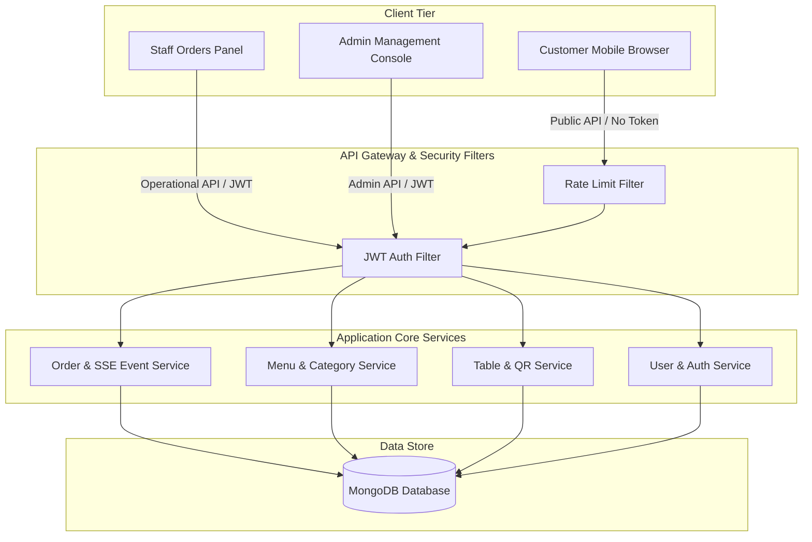

# QR Food Ordering & Restaurant Management System

A fullstack QR-based food ordering and restaurant management platform built with **Spring Boot**, **Next.js**, **MongoDB**, **Docker**, and **GitHub Actions CI/CD**.

[](https://github.com/bachle1302/qr-food-order-system/actions/workflows/backend-ci.yml)
[](https://github.com/bachle1302/qr-food-order-system/actions/workflows/frontend-ci.yml)
[](https://github.com/bachle1302/qr-food-order-system/actions/workflows/docker-ci.yml)

---

## 🌟 Overview

This project is a modern, mobile-first QR code dining and restaurant management system (RMS). It enables contactless dining where customers scan a QR code at their table to check-in, browse the menu, and place orders directly. Staff and kitchen workers manage the order lifecycle in real-time, while administrators monitor operations, configure menus/tables, and view analytics.

---

## 🚀 Key Features

### 📱 Customer (Mobile-First QR Ordering)
* **Table QR Scan & Check-in**: Scan a unique QR token to check in with a guest name/phone.
* **Smart Menu Browsing**: Sleek category navigation, dish details, active discounts, and customizations.
* **Isolated Session Order Tracking**: Customers track only their active session orders; they cannot view past sessions or orders from other tables.
* **Subtotal & Cart Management**: Live cart subtotal calculations and notes for the kitchen.

### 🧑‍🍳 Staff & Kitchen Dashboard
* **Real-time Order Updates**: Incoming orders trigger instant UI notifications via Server-Sent Events (SSE).
* **Order Lifecycle Control**: Transition orders through statuses (`PENDING`, `CONFIRMED`, `COOKING`, `COMPLETED`, `CANCELLED`).
* **Kitchen View**: Focuses entirely on active cooking items (`CONFIRMED`, `COOKING`).
* **Operational Isolation**: Staff can manage orders but cannot modify menus, tables, discounts, or user accounts.

### 👑 Admin Management & Analytics
* **Table & QR Token Generator**: CRUD tables and regenerate secure QR token links.
* **Menu Management**: CRUD dishes, price listings, images, and categories.
* **Staff/User Management**: CRUD users and toggle activation state (`isActive = false` locks and invalidates user JWTs immediately).
* **Discount Code Campaigns**: Manage codes, percentage values, minimum orders, and maximum limits.
* **Revenue Dashboard**: Analyze daily statistics, average order values, and best-selling dishes.

### 🛡️ Security & Production-Like Architecture
* **JWT Authentication**: Secure stateless token validation with separate access/refresh lifecycle.
* **Granular Role-Based Access Control (RBAC)**: Stricter authorization protecting administration routes via Spring Security.
* **Rate Limiting**: Public API protection (check-in, checkout, QR details) against DDoS/spam via custom in-memory filters.
* **Security Integration Tests**: Complete automated tests covering authorization, invalid tokens, and rate limits.
* **Strict TypeScript Standard**: Enabled strict linter parameters (`no-explicit-any`) to ensure compile-time safety.

---

## 🛠️ Tech Stack

* **Backend**: Java 17, Spring Boot, Spring Security (JWT), Spring Data MongoDB, Maven, Server-Sent Events (SSE), In-memory Rate Limiting.
* **Frontend**: Next.js 16 (App Router), TypeScript, TailwindCSS, shadcn/ui, Recharts.
* **DevOps & Testing**: Docker, Docker Compose, GitHub Actions CI, JUnit 5, Mockito.

---

## 📐 Architecture & System Flow



### Main Operational Flow
1. **Admin Setup**: Admin configures the tables and exports unique QR tokens.
2. **Customer Entry**: Customer scans the QR code at the table, checking in with their name/phone.
3. **Food Ordering**: Customer browses the menu, places an order, and tracks its preparation.
4. **Real-time Dispatch**: The system broadcasts the order details to the Staff/Kitchen dashboard via SSE.
5. **Kitchen Preparation**: Kitchen accepts, prepares, and updates the order status.
6. **Billing & Session Closure**: Staff closes the order upon completion.

---

## 👥 Role Permissions Matrix

| Operational Action | ADMIN | STAFF | CUSTOMER (Guest) |
| :--- | :---: | :---: | :---: |
| Manage System Users | ✅ | ❌ | ❌ |
| View Revenue Analytics | ✅ | ❌ | ❌ |
| Configure Tables & QR Codes | ✅ | ❌ | ❌ |
| Create/Edit Menu & Discounts | ✅ | ❌ | ❌ |
| Update Order Preparation Status | ✅ | ✅ | ❌ |
| Connect to Real-time SSE Events | ✅ | ✅ | ❌ |
| Scan QR & Check-in | ❌ | ❌ | ✅ |
| Submit Order & Track Progress | ❌ | ❌ | ✅ |

## 📚 Documentation

- [Deployment Guide](docs/DEPLOYMENT.md)
- [API Security Notes](docs/API_SECURITY.md)

---

## 🐳 Getting Started with Docker

Ensure you have Docker and Docker Compose installed.

### 1. Set Up Environment Variables
Copy the template configuration file:
```bash
cp .env.example .env
```
*(The default configuration contains safe dev values and database seeds. For production, please override with secure secrets).*

### 2. Start the Containers
```bash
docker compose up --build -d
```

### 3. Access the Applications
* **Frontend Application**: [http://localhost:3000](http://localhost:3000)
* **Backend API Console**: [http://localhost:8017](http://localhost:8017)
* **MongoDB Instance**: `localhost:27017`

### 🔑 Demo Accounts (Auto-Seeded)
* **ADMINISTRATOR**:
  * **Email**: `admin@qrfood.local`
  * **Password**: `Admin@123456`
* **STAFF**:
  * **Email**: `staff@qrfood.local`
  * **Password**: `Staff@123456`

---

## 💻 Local Development

### Backend (Spring Boot)
1. Navigate to the backend directory:
   ```bash
   cd backend
   ```
2. Run automated verification tests:
   ```bash
   mvn test -Dspring.profiles.active=test
   ```
3. Compile and package:
   ```bash
   mvn clean package
   ```

### Frontend (Next.js)
1. Navigate to the frontend directory:
   ```bash
   cd frontend
   ```
2. Install dependencies:
   ```bash
   npm install
   ```
3. Run ESLint syntax verification:
   ```bash
   npm run lint
   ```
4. Run TypeScript compile checks:
   ```bash
   npx tsc --noEmit
   ```
5. Build the production package:
   ```bash
   npm run build
   ```

---

## ⚙️ Environment Variables Outline
The system reads the following variables from the `.env` file:
* `MONGODB_URI`: Connection string to the MongoDB cluster.
* `JWT_SECRET`: Base64 encoded key (at least 256-bit) to sign and verify JWT tokens.
* `CORS_ALLOWED_ORIGINS`: Allowed origins (e.g., `http://localhost:3000`).
* `NEXT_PUBLIC_API_BASE_URL`: Public API path prefix utilized by Next.js components.
* `APP_RATE_LIMIT_ENABLED`: Global toggle for Public API rate limiting.
* `APP_SEED_ENABLED`: Seed admin accounts, dishes, and tables if the database is empty.

---

## 🧪 Automated Testing & CI/CD Pipelines

The codebase integrates three separate automation jobs on **GitHub Actions** triggered on every push and pull request:
1. **Backend CI** (`backend-ci.yml`): Compiles, runs authorization and rate-limiting tests, and packages the Spring Boot Jars.
2. **Frontend CI** (`frontend-ci.yml`): Runs linter checks, TypeScript compiler tests, and exports static/optimized Next.js pages.
3. **Docker CI** (`docker-ci.yml`): Verifies Compose config validity and tests building docker images for both backend and frontend.

---

## 📈 Production Recommendations

* **Distributed Rate Limiting**: The current rate-limiting is in-memory. If scaling to multiple server nodes, migrate the filter storage to **Redis**.
* **Sensitive Secrets**: Never commit `.env` files to git. Use secure environment inject systems in your cloud provider.
* **CORS Settings**: Restrict `CORS_ALLOWED_ORIGINS` strictly to your domain on production servers.

---

## 📸 Screenshots

### 📱 Customer QR Ordering Flow (Mobile-First)

<table>
  <tr>
    <td align="center" valign="top" width="33%">
      <b>1. Menu Browsing</b><br/><br/>
      
    </td>
    <td align="center" valign="top" width="33%">
      <b>2. Cart & Notes</b><br/><br/>
      
    </td>
    <td align="center" valign="top" width="33%">
      <b>3. Real-time Status</b><br/><br/>
      
    </td>
  </tr>
</table>

### 🧑‍🍳 Staff Orders Dashboard


### 👑 Admin Analytics & Management


### 📊 Table & QR Code Generation


---

## 💼 Key CV Highlights for Recruiters

* **Real-time Event Broadcasting**: Implemented reactive order updates from server to web UI using Server-Sent Events (SSE) instead of heavy polling.
* **Stateless Token Management**: Built a JWT Authentication system featuring an active account state verify (`isActive`) interceptor to instantly lock and terminate rogue active tokens.
* **Robust Security Verification**: Designed comprehensive JUnit integration tests covering granular admin vs staff role permissions and custom HTTP 429 rate limit triggers.
* **Strict Type Safety**: Migrated the frontend application to strict TypeScript compiler standards (`no-explicit-any`), leading to cleaner refactoring and zero run-time crash bugs.
* **Infrastructure Dockerization**: Configured multi-container Docker Compose files enabling zero-configuration development startup.
